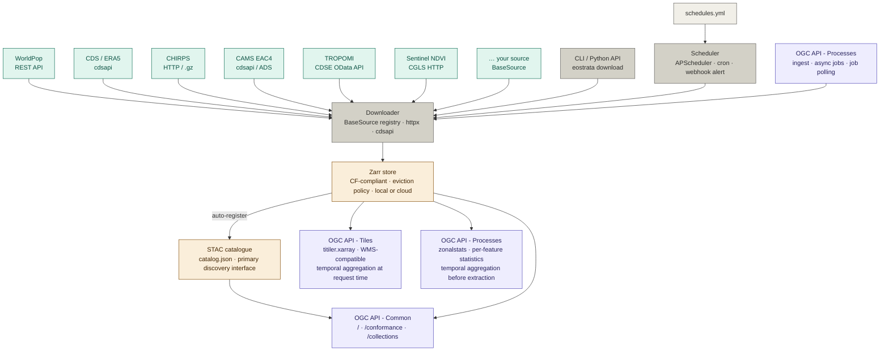

# eostrata

*One tool to fetch, store, aggregate, and serve earth observation layers.*

---

## Features

- **Multi-source ingestion**: fetches earth observation data through a unified `BaseSource` plugin interface. New sources register with a single decorator — the scheduler, catalogue, map UI, and store pick them up automatically.

  | Source | Description | Resolution |
  |---|---|---|
  | `worldpop` | WorldPop population count rasters | Annual |
  | `chirps` | CHIRPS precipitation | Monthly |
  | `cds` | CDS / ERA5 climate reanalysis | Monthly |
  | `cams` | CAMS EAC4 air quality reanalysis | Monthly |
  | `tropomi` | Sentinel-5P TROPOMI air quality columns | Daily |
  | `sentinel_ndvi` | CGLS Sentinel-3 NDVI 300m composites | Dekadal |
  | _your source_ | _one `.py` file, one decorator_ | _any_ |

- **Zarr collection store**: each ingested resource is stored as a CF-compliant (Climate and Forecast conventions - standard naming for dimensions, coordinates, units and fill values) Zarr collection with `x`, `y`, and `time` dimensions, locally or on cloud object storage. When the storage quota is reached, data is evicted before new downloads proceed.

- **STAC catalogue**: every collection is automatically registered as a STAC item in an embedded `stac-fastapi` catalogue, persisted in `catalog.json`. Primary discovery interface for datasets and their assets.

- **OGC-compliant serving**: all endpoints follow OGC API - Common conventions (`/`, `/conformance`, `/collections`) as a compatibility shim for OGC-native clients. All serving endpoints accept a `datetime` range and an `agg` parameter for **temporal aggregation** - collapsing the time dimension at request time with no pre-computed intermediates. Supported methods: `mean`, `sum`, `min`, `max`, and `anomaly` (deviation from a user-defined `baseline` period expressed as an ISO 8601 interval).
  - **OGC API - Tiles**: dynamic raster tiles served directly from the Zarr store via `titiler.xarray`, no intermediate COG export. WMS-compatible. On-the-fly styling via `colormap_name` and `rescale`. Each tile can represent a single timestep or a temporally aggregated period.
  - **OGC API - Processes - Zonal Statistics**: summarises raster values within polygon zones. The `zonalstats` process accepts a GeoJSON `FeatureCollection` and returns per-feature statistics (mean, sum, min, max, std, count, percentiles). Temporal aggregation parameters apply before zonal extraction, so statistics can be computed over a single timestep or a temporally aggregated period.
  - **OGC API - Processes - Ingest**: async ingestion jobs (`POST /processes/ingest/execution`) that download, clip, and write data to the Zarr store without blocking the server. Job status is tracked and pollable via `GET /processes/jobs/{job_id}`.

- **Automated scheduler**: an `APScheduler` instance runs in-process alongside the FastAPI server. Jobs are declared in `schedules.yml` with cron expressions. Each source exposes its typical data lag so `auto_period: true` targets the latest available interval. Failed jobs retry with exponential backoff then dispatch a webhook alert.

---

## Architecture



### Module map

```
eostrata/
├── eostrata/
│   ├── sources/
│   │   ├── base.py          BaseSource ABC + @register_source registry + retry logic
│   │   ├── worldpop.py      WorldPopSource — annual population rasters
│   │   ├── chirps.py        CHIRPSSource — monthly precipitation
│   │   ├── cds.py           CDSSource — ERA5 monthly reanalysis
│   │   ├── cams.py          CAMSSource — EAC4 monthly air quality
│   │   ├── tropomi.py       TROPOMISource — Sentinel-5P daily air quality
│   │   ├── sentinel_ndvi.py SentinelNDVISource — dekadal NDVI
│   │   ├── _template.py     minimal template for new sources
│   │   └── __init__.py      populates the source registry on import
│   ├── ogc/
│   │   ├── ingest.py        OGC API - Processes: async ingest jobs + job polling
│   │   ├── tiles.py         OGC API - Tiles (wraps titiler.xarray)
│   │   └── processes.py     OGC API - Processes: zonalstats
│   ├── templates/
│   │   └── map.html         interactive map viewer (Leaflet)
│   ├── config.py            pydantic-settings · all env vars
│   ├── store.py             GeoTIFF → Zarr · clip · nodata handling
│   ├── ingestion.py         download + zarr write + STAC registration (sync)
│   ├── cache.py             quota tracking · LRU eviction · access sentinels
│   ├── catalog.py           pystac STAC catalogue backend
│   ├── aggregate.py         AggregatingReader · temporal aggregation
│   ├── jobs.py              in-memory async job store
│   ├── log.py               logging setup · rotating file handler
│   ├── scheduler.py         APScheduler · cron jobs · retry · webhook alert
│   ├── server.py            assembles all routers · OGC Common endpoints
│   └── cli.py               Typer CLI
├── schedules.yml            user-facing schedule config
└── pyproject.toml
```

---

