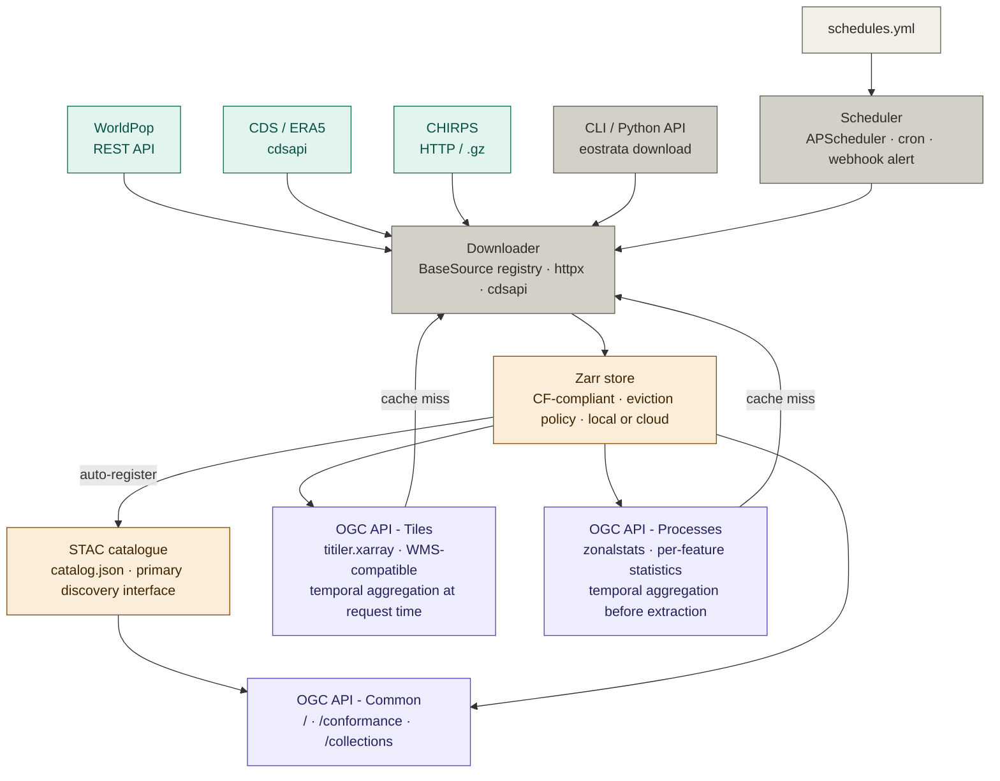

# eostrata

> **⚠️ This is a design document, not a working implementation. Everything described below is planned - no code has been written yet.**

*One tool to fetch, store, aggregate, and serve earth observation layers.*

---

## Features

- **Multi-source ingestion**: fetches earth observation data through a unified `BaseSource` plugin interface. New sources register with a single decorator: the scheduler, catalogue, and store pick them up automatically.
  - WorldPop population rasters
  - CDS / ERA5 climate reanalysis
  - CHIRPS precipitation

- **Zarr collection store**: each ingested resource is stored as a CF-compliant (Climate and Forecast conventions - standard naming for dimensions, coordinates, units and fill values) Zarr collection with `x`, `y`, and `time` dimensions, locally or on cloud object storage. When the storage quota is reached, data is evicted before new downloads proceed.

- **STAC catalogue**: every collection is automatically registered as a STAC item in an embedded `stac-fastapi` catalogue, persisted in `catalog.json`. Primary discovery interface for datasets and their assets.

- **OGC-compliant serving**: all endpoints follow OGC API - Common conventions (`/`, `/conformance`, `/collections`) as a compatibility shim for OGC-native clients. All serving endpoints accept a `datetime` range and an `agg` parameter for **temporal aggregation** - collapsing the time dimension at request time with no pre-computed intermediates. Supported methods: `mean`, `sum`, `min`, `max`, and `anomaly` (deviation from a user-defined `baseline` period expressed as an ISO 8601 interval). Requests for a datetime range not yet in the store trigger a download before serving.
  - **OGC API - Tiles**: dynamic raster tiles served directly from the Zarr store via `titiler.xarray`, no intermediate COG export. WMS-compatible. On-the-fly styling via `colormap_name` and `rescale`. Each tile can represent a single timestep or a temporally aggregated period.
  - **OGC API - Processes - Zonal Statistics**: summarises raster values within polygon zones. The `zonalstats` process accepts a GeoJSON `FeatureCollection` and returns per-feature statistics (mean, sum, min, max, std, count, percentiles). Temporal aggregation parameters apply before zonal extraction, so statistics can be computed over a single timestep or a temporally aggregated period.

- **Automated scheduler**: an `APScheduler` instance runs in-process alongside the FastAPI server. Jobs are declared in `schedules.yml` with cron expressions. Each source exposes its typical data lag so `auto_period: true` targets the latest available interval. Failed jobs retry with exponential backoff then dispatch a webhook alert.

---

## Architecture



### Module map

```
eostrata/
├── eostrata/
│   ├── sources/
│   │   ├── base.py          BaseSource ABC + @register_source registry
│   │   ├── worldpop.py      WorldPopSource
│   │   ├── cds.py           CDSSource
│   │   ├── chirps.py        CHIRPSSource
│   │   └── __init__.py      populates the source registry on import
│   ├── ogc/
│   │   ├── common.py        OGC API - Common: / · /conformance · /collections
│   │   ├── tiles.py         OGC API - Tiles (wraps titiler.xarray)
│   │   └── processes.py     OGC API - Processes (zonalstats)
│   ├── config.py            pydantic-settings · all env vars
│   ├── store.py             GeoTIFF / NetCDF -> Zarr · triggers catalogue
│   ├── cache.py             cache-miss detection · eviction policy
│   ├── catalog.py           pystac + stac-fastapi catalogue backend
│   ├── aggregate.py         AggregatingReader · temporal aggregation
│   ├── dependencies.py      shared FastAPI query params (datetime, agg, baseline)
│   ├── zonal.py             clip_box · rio.clip · numpy statistics
│   ├── scheduler.py         APScheduler · retry · webhook
│   ├── server.py            assembles all routers
│   └── cli.py               Typer CLI
├── schedules.yml            user-facing schedule config
├── pyproject.toml
├── Dockerfile
└── docker-compose.yml
```

---

*Design subject to change during implementation.*
